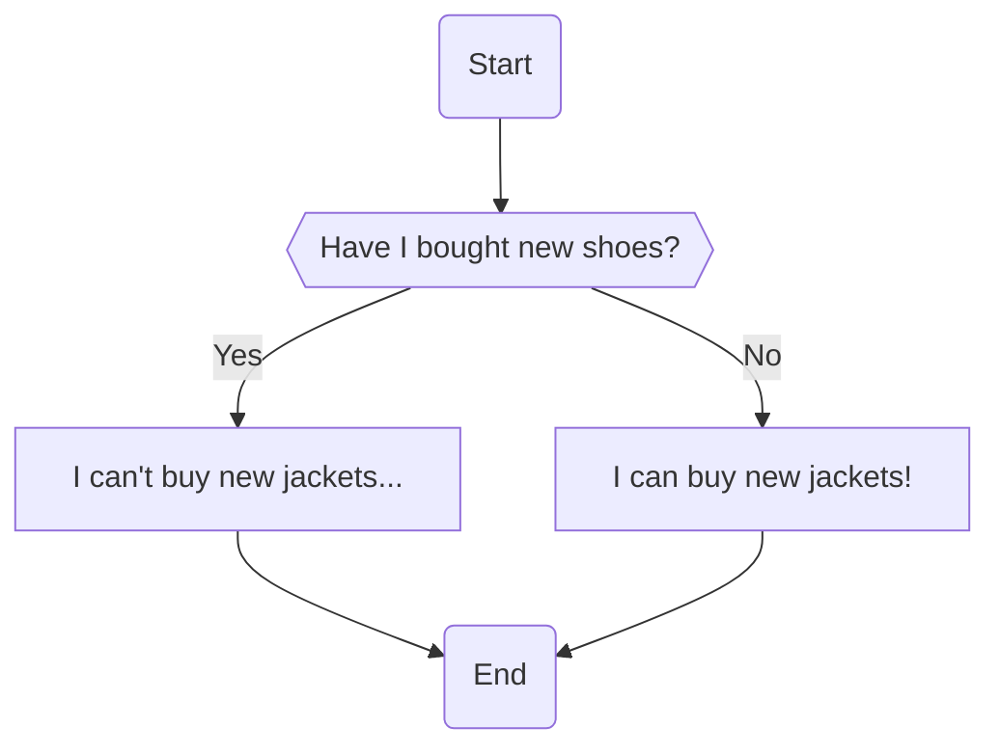

# Lesson 3 - If/Else Statements

## Introduction
In the previous lesson, we learnt about how to make better use of data and variables using operators. [Here are the notes from Lesson 2 if you need a refresh.]()

However, not everything can be done using just operators and variables. What if we have a few possible situations, and we need to have different outcomes based on each scenario? Not to worry if you have no idea what to do at this point, because what we will be learning today will help with this!

## What is an if/else statement?
Also known as a conditional statement, if/else statements check if a given condition is true, and allow us to consider actions that only occur when something specfic happens (what we call _conditionals_)

### Using a flowchart to visualise if/else statements
It will be extremely useful for us to have a way to represent if/else pictorially, as it will help us better understand how an if/else statement controls the flow of our program!

Do you remember that I like shopping online? If you don't, it's alright! [Here's the place I declared my love for that!]()

I remembered my parents told me that if I didn't buy any shoes, I can go and buy a jacket! We can now use a flowchart to repesent my thought process!


**Note:** The symbol for decisions is conventionally set as a rhombus or diamond, but we opted with a flat hexagon here to save space.

```python
not_bought_shoes = True

if not_bought_shoes:
    print("I can buy a new jacket!")
else:
    print("I... I... can't buy the newest jacket...")
```

```
> I can buy a new jacket!
```

## More Examples
We can have _nested_ if/else statements by putting an if/else statement _inside_ the body of an if/else statement.

```python
weather = "sunny"
work = "yes"

if weather == "sunny":
    if work == "no":
        print("Let's go to the beach!")
    else:
        print("I have work to do....")
else:
    print("Seems like it will rain, I don't think we should go to the beach...")
```

```
> I have work to do...
```

We can also test for multiple (mutually exclusive) conditions at the same time by using the keyword `elif`!

```python
price_of_salmon_bento_set = 18.90
price_of_chicken_bento_set = 12.90
price_of_seaweed_rice_set = 7.90
price_of_onigiri = 3.00

money_i_have = 15.00

if money_i_have >= 18.90:
    print("I will have the salmon bento set!")
elif money_i_have >= 12.90:
    print("I will have the chicken bento set!")
elif money_i_have >= 7.90:
    print("I will have the seaweed bento set!")
elif money_i_have >= 3.00:
    print("I will have the onigiri!")
else:
    print("I guess I will go hungry...")
```

```
> I will have the chicken bento set!"
```

**Stop and ponder:** Why don't we have to account for the upper bounds of `money_i_have` in the `elif` clauses?

## Let's practise 
You're the inventory manager for a warehouse that supplies soft drinks. You have a fixed number of cases of drinks in your stock. Each case costs $15. To cover delivery costs, the minimum order amount must be at least $100.

Write a program that helps you evaluate new orders. Your program should take in the number of cases ordered, then decide if you should accept the order using the conditions above, as well as consider if you have enough cases to fufill the order. Print out: whether you're accepting the order, the amount of money you should receive, and how much stock you'll have left after fulfilling the order.

---

You are visiting your favourite Korean restaurant, and it offers a variety of foods as shown in their menu:

| Item                               | Price |
|------------------------------------|-------|
| Spicy Chicken Bulgogi Set          | 12.90 |
| Kimchi Fried Rice                  | 9.00  |
| Pancake                            | 5.00  |
| Tteok-bokki (Korean Rice Cake)     | 5.00  |

Write a program that helps you decide whether to place an order. Your program should take in the amount of money you have initially, the number of each item you want to purchase, then place the order only if you have enough money. You should also print out how much money you have left in the end should you have placed an order.

---

I need some help to decide how I should spend my time! I can do the following things depending on what is happening tomorrow:

- Sleep early (provided that I have completed my homework or none of my friends are online, and there is no school tomorrow)
- Homework (provided that there is school tomorrow)
- Play some games (provided that I have friends online and there is no school tomorrow)

Write a program that allows me to input if I have school tomorrow, if I have completed my homework and if I have friends online, then print what I should do!

## Conclusion
If/Else statements allow us to control the flow of programs by testing for specific conditions.

In the next lesson, you will learn more about the different ways we can control the flow of our program!

### Further reading
Flowcharts can actually be used to represent the flow of programs in many situations! Due to its wide applicability, there are conventions that govern how we draw flowcharts.

- [Flowchart symbols](https://www.smartdraw.com/flowchart/flowchart-symbols.htm)
