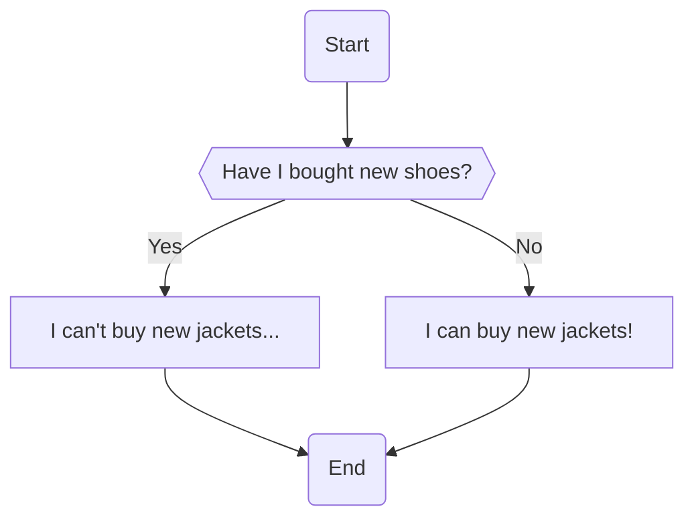

# Lesson 3 - If/Else Statements

## Introduction
In the previous lesson, we learnt about how to make better use of data and variables using operators. [Here are the notes from Lesson 2 if you need a refresh.]()

However, not everything can be done using just operators and variables. What if we have a few possible situations, and we need to have different outcomes based on each scenario? Not to worry if you have no idea what to do at this point, because what we will be learning today will help with this!

## What is an if/else statement?
Also known as a conditional statement, if/else statements check if a given condition is true, and allow us to consider actions that only occur when something specfic happens (what we call _conditionals_)

### Using a flowchart to visualise if/else statements
It will be extremely useful for us to have a way to represent if/else pictorially, as it will help us better understand how an if/else statement controls the flow of our program!

Do you remember that I like shopping online? If you don't, it's alright! [Here's the place I declared my love for that!]()

I remembered my parents told me that if I didn't buy any shoes, I can go and buy a jacket! We can now use a flowchart to repesent my thought process!


**Note:** The symbol for decisions is conventionally set as a rhombus or diamond, but we opted with a flat hexagon here to save space.

```python
not_bought_shoes = True

if not_bought_shoes:
    print("I can buy a new jacket!")
else:
    print("I... I... can't buy the newest jacket...")
```

```
> I can buy a new jacket!
```

## More Examples
We can have _nested_ if/else statements by putting an if/else statement _inside_ the body of an if/else statement.

```python
weather = "sunny"
work = "yes"

if weather == "sunny":
    if work == "no":
        print("Let's go to the beach!")
    else:
        print("I have work to do....")
else:
    print("Seems like it will rain, I don't think we should go to the beach...")
```

```
> I have work to do...
```

We can also test for multiple (mutually exclusive) conditions at the same time by using the keyword `elif`!

```python

```

## Let's practise

## Conclusion

### Further reading
Flowcharts can actually be used to represent the flow of programs in many situations! Due to its wide applicability, there are conventions that govern how we draw flowcharts.

- [Flowchart symbols](https://www.smartdraw.com/flowchart/flowchart-symbols.htm)
