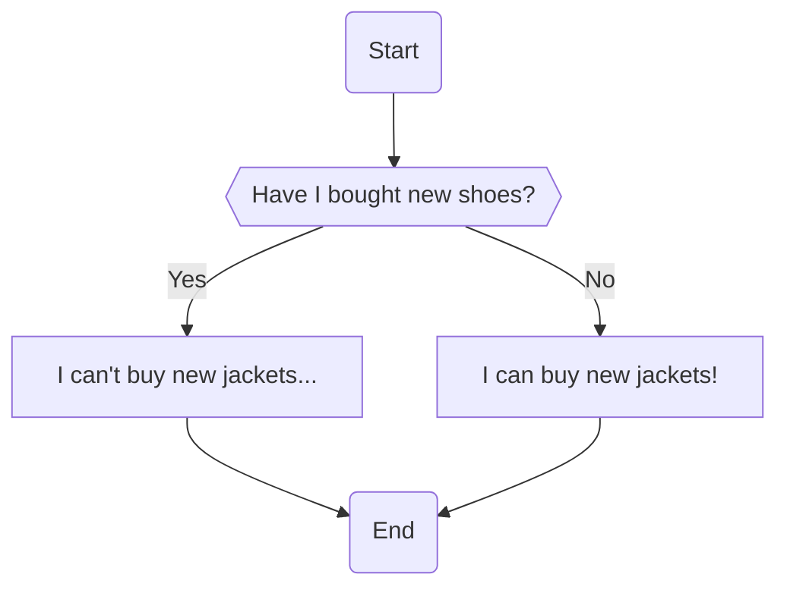
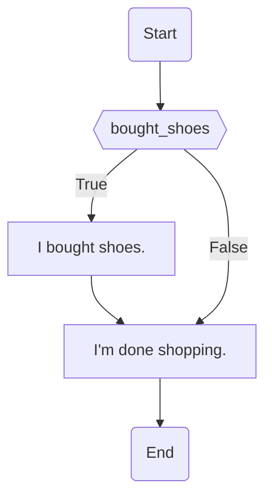
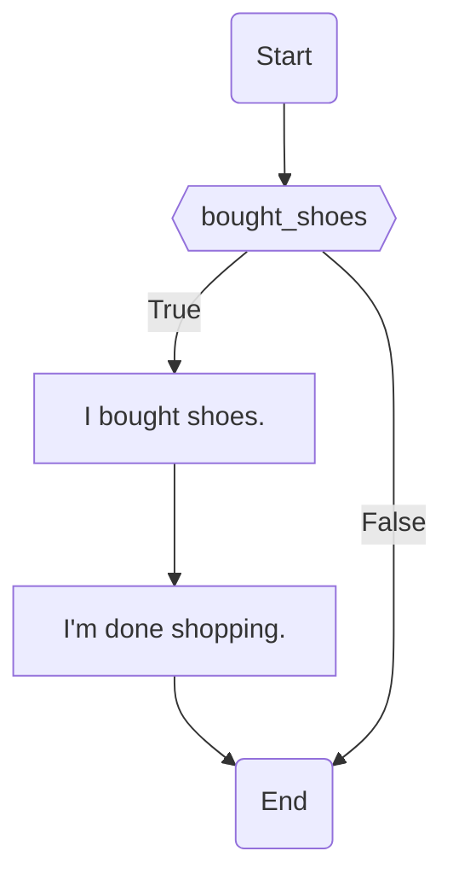
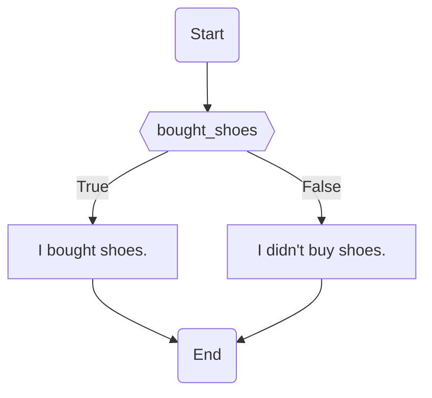
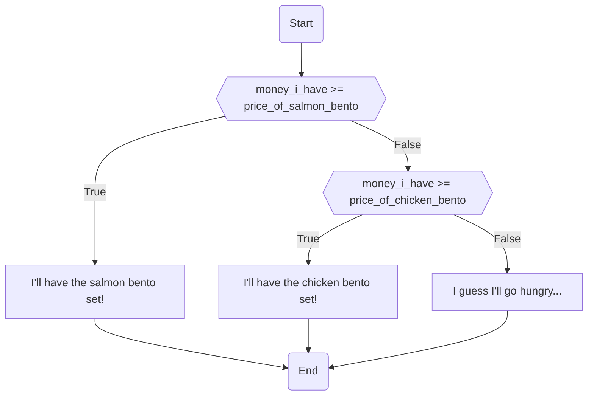

# Lesson 3 - If/else statements

## Introduction
In the previous lesson, we learnt about how to make better use of data and variables using operators. [Here are the notes from Lesson 2 if you need a refresh.](https://github.com/qitianshi/tyros-resources/tree/main/Lesson%202)

All the programming we've learned so far has been linear — our code looks like step-by-step instructions that runs through every line. But what if we need our code to do different things in different situations? That's where the almighty if/else statement comes in!

## Conditions
Do you remember my love for online shopping? In the last lesson, we wrote programmes that helped me decide whether I should buy shoes and jackets using [logic operators](https://github.com/qitianshi/tyros-resources/tree/main/Lesson%202#logical-operators).

In one example, my parents told me that if I hadn't bought any shoes, I could go and buy a jacket. This is what the code for that example looked like:

```Python
bought_shoes = False

will_buy_jacket = not bought_shoes
print("Will I buy a new jacket?", will_buy_jacket)
```

Let's use a flowchart to repesent my decision process. We'll be using flowcharts a lot in this lesson to visualise the different possible pathways our code can take.



Here, the condition is "Have I bought new shoes?" Depending on whether the condition is true or false, I do different things. My path splits into two, and I only perform one of those options. Of course, I would never do both, because a condition can't be both true _and_ false!

## `if`
All if/else statements make our code do different things depending on some condition. The simplest form is a single `if`.

This is what it looks like:

```Python
bought_shoes = True

if bought_shoes:
    print("I bought shoes")
```

Here, `bought_shoes` is the condition. If the condition is `True`, it runs the code that says `print("I bought shoes")`. If the condition is `False`, it skips the `print` statement. Try changing the value of `bought_shoes` to `False`. What happens now?

### Indentation
Notice that the `print` statement in the code above is further to the right than the rest of the code. This is called **indentation**; we say that the `print` statement is "indented". You indent your code by typing a `tab` (with the `tab` key).

Indentation is very important in Python. By indenting the `print` statement, we tell Python that it "belongs" to the `if` statement. If you don't indent your code properly, it might behave unexpectedly, or even not work at all!

Try running this code:

```Python
bought_shoes = True

if bought_shoes:
    print("I bought shoes")

print("I'm done shopping")
```

As expected, it prints both `I bought shoes` and `I'm done shopping`. Now, try changing the value of `bought_shoes` to `False`. Just as we saw just now, it skips the line that prints `I bought shoes`, but it still prints `I'm done shopping`.

Now, indent the last line, so your code ends up looking like this:

```Python
bought_shoes = True

if bought_shoes:
    print("I bought shoes")

    print("I'm done shopping")
```

Try running this code, the first time with `bought_shoes = True` and the second time with `bought_shoes = False`. Now, when the condition is `True`, it prints both lines, but when the condition is `False`, neither line is printed.

As a flowchart, the first code looks like this:



And the second code looks like this:



## `if`, `else`
You can also define a sequence of actions for if the condition is `False`, using the `else` statement.

If the condition is true, Python will run the code indented under the `if` statement. If the condition is false, Python will run the code under the `else` statement. Pay careful attention to how everything is indented.

```Python
bought_shoes = True

if bought_shoes:
    print("I bought shoes.")
else:
    print("I didn't buy shoes.")
```

Once again, try changing the value of `bought_shoes` to see how your code behaves. Also try adding more lines of code under the `if` and `else` statements, and play with their indentations.

Here's what our code looks like as a flowchart:



You can't write an `else` without an `if`.

```Python
# This won't work!
else:
    print("The else condition.")
```

You also can't write conditions after `else`. Remember, `else` simply runs whenever the condition after `if` is `False`.

```Python
# This doesn't work either!
else some_condition:
    print("The else condition.")
```

Finally, an `else` statement must immediately follow an `if` statement's indented block.

```Python
# This also won't work!

if some_condition:
    print("The if condition.")

print("Unindented code.")

else some_condition:
    print("The else condition.")
```

## `if`, `elif`, `else`
Finally, we can have our code evaluate a second condition if the first condition evaluated to `False`, using `elif`.

```Python
price_of_salmon_bento = 18.90
price_of_chicken_bento = 12.90

money_i_have = 15.00

if money_i_have >= price_of_salmon_bento:
    print("I'll have the salmon bento set!")
elif money_i_have >= price_of_chicken_bento:
    print("I'll have the chicken bento set!")
else:
    print("I guess I'll go hungry...")
```



`elif` is short for "else if". In fact, you can rewrite all `elif` statements as nested if/else statements [(see below)](https://github.com/qitianshi/tyros-resources/tree/main/Lesson%203#nested-ifelse). `elif` is an elegant shorthand that makes our code much easier to read.

We can have as many `elif` statements as we want:

```Python
price_of_salmon_bento_set = 18.90
price_of_chicken_bento_set = 12.90
price_of_seaweed_rice_set = 7.90
price_of_onigiri = 3.00

money_i_have = 15.00

if money_i_have >= price_of_salmon_bento_set:
    print("I'll have the salmon bento set!")
elif money_i_have >= price_of_chicken_bento_set:
    print("I'll have the chicken bento set!")
elif money_i_have >= price_of_seaweed_rice_set:
    print("I'll have the seaweed bento set!")
elif money_i_have >= price_of_onigiri:
    print("I'll have the onigiri!")
else:
    print("I guess I'll go hungry...")
```

## Nested if/else
We can have nested if/else statements by putting an if/else statement inside the body of another if/else statement. There are now two levels of indentation in our code.

```Python
weather = "sunny"
work = True

if weather == "sunny":
    if not work:
        print("Let's go to the beach!")
    else:
        print("I have work to do....")
else:
    print("Seems like it will rain, I don't think we should go to the beach...")
```

## Let's practise
Do you remember the inventory manager problem from last week?

> You're the inventory manager for a warehouse that supplies soft drinks. You have a fixed number of cases of drinks in your stock. Each case costs $15. To cover delivery costs, the minimum order amount must be at least $100.
>
> Write a program that helps you evaluate new orders. Your program should take in the number of cases ordered, then decide if you should accept the order using the conditions above, as well as consider if you have enough cases to fufill the order. Print out: whether you're accepting the order, the amount of money you should receive, and how much stock you'll have left after fulfilling the order.

Previously, because we hadn't learned if/else, our code was limited to printing "True" or "False", and we sometimes ended up with negative stocks!

Using if/else statements, improve your code with more user-friendly messages. If the order is rejected, don't print the price of the order or the amount of stock left.

---

I need some help to decide how I should spend my time! I can do the following things depending on what is happening tomorrow:

* Sleep early (if I have completed my homework or none of my friends are online, and there is no school tomorrow)
* Homework (if there is school tomorrow)
* Play some games (if I have friends online and there is no school tomorrow)

Write a program that allows me to input if I have school tomorrow, if I have completed my homework and if I have friends online, then print what I should do!

---

In Singapore, individual income taxes are calculated based on a progressive tax model. Using the [information on the IRAS website](https://www.iras.gov.sg/taxes/individual-income-tax/basics-of-individual-income-tax/tax-residency-and-tax-rates/individual-income-tax-rates), write an income tax calculator for a tax resident for 2022.

## Conclusion
If/else statements allow us to control the flow of programmes by testing for specific conditions, and splitting it into multiple pathways.

In the next lesson, we'll explore more ways to control the flow of our programmes!

### Further reading
* [If/else](https://www.w3schools.com/python/python_conditions.asp)
* [Python indentation](https://www.w3schools.com/python/python_syntax.asp#python_indentation)
* [Flowcharts](https://www.bbc.co.uk/bitesize/guides/z7kkw6f/revision/3)

---

© 2022 Qi Tianshi and Tew En Hao. This file is licensed under the [Creative Commons Attribution-NonCommercial-ShareAlike 4.0 International license (CC BY-NC-SA 4.0) license](https://creativecommons.org/licenses/by-nc-sa/4.0/).
